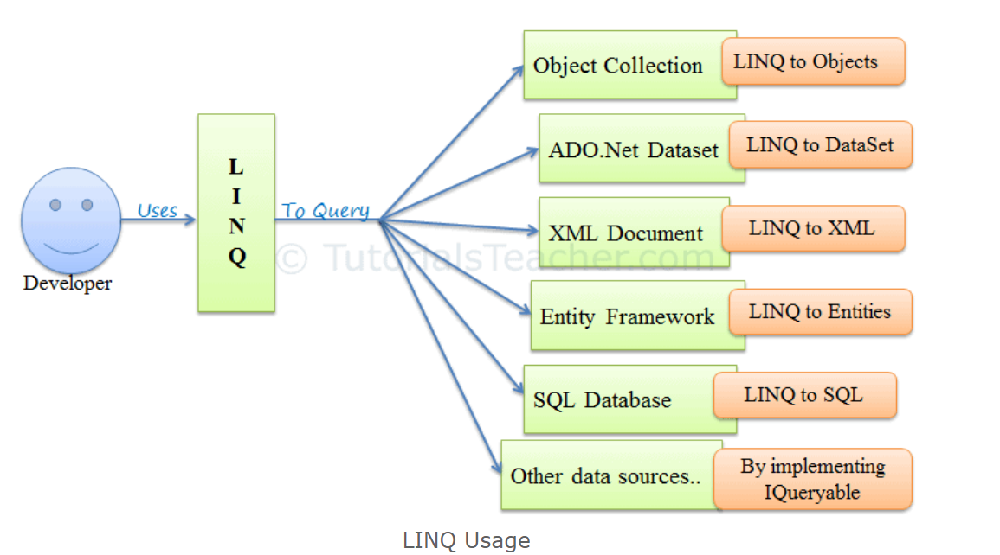
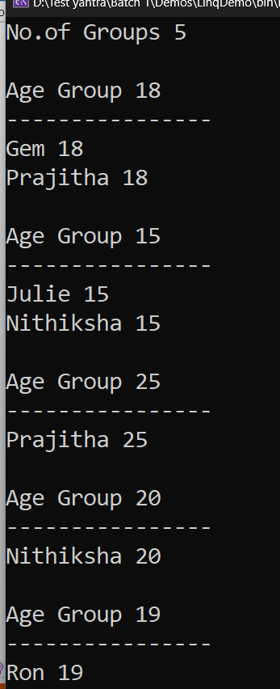
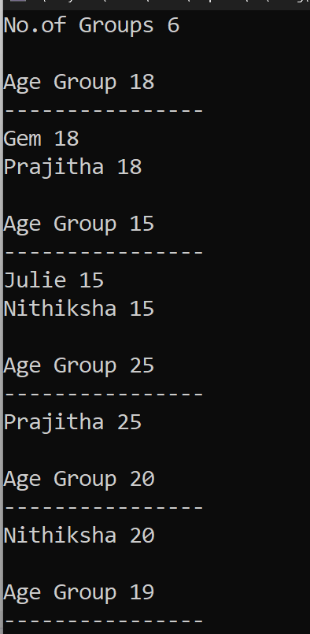

What is LINQ?



In C#, LINQ (Language-Integrated Query) queries can be written in two primary ways: 
**Query Syntax**
**Method Syntax**

# LINQ Query Syntax
Query Syntax is more similar to SQL, providing a readable and declarative way of writing queries. Under the hood, it gets translated into Method Syntax at compile time. This is one of the easy ways to write complex LINQ queries in an easy and readable format. If you are familiar with SQL Queries, it will be easy for you to write LINQ queries using this query syntax.
# LINQ Method Syntax:
Method Syntax (also known as Fluent Syntax or Lambda Syntax) uses extension methods included in the System.Linq namespace and can be chained together to perform complex queries. It is similar to calling methods in a traditional object-oriented programming language. Method syntax has become most popular nowadays for writing LINQ queries. In this approach, the LINQ query is written using multiple methods by combining them with a dot (.), i.e., method chaining.

# LINQ Mixed Syntax:
You can also mix both syntaxes, although this is less common. This is the combination of both Query and Method syntax.

create a new  console app==> LinqDemo
Add new class==>LINQQueryToArray

```cs
using System.Linq;

namespace LinqDemo
{
    internal class LINQQueryToArray
    {
        string[] names = { "Meghana", "Sunai", "Mahalakshmi" };

       public void FilterNameContainsL()
        {
            //query syntax
            var nameswithL=from name in names
                           where name.Contains('h')
                           select name;

            Console.WriteLine("List of names which contains h");
            foreach (var name in nameswithL)
            {
                Console.WriteLine(name);
            }
             //method syntax
                var namewithfilter=names
                    .Where(n=> n.Contains('h'))
                    .ToList();
                Console.WriteLine("List of names which contains h");
                foreach (var name in namewithfilter)
                {
                    Console.WriteLine(name);
                }
                        }
                    }
                }
```

# LINQ Operators in C#
# What are LINQ Operators?
The LINQ Operators are nothing but a set of extension methods used to write the LINQ Query. These LINQ extension methods provide many useful features we can apply to the data source. Some of the features are filtering the data, sorting the data, grouping the data, etc.

# What are the Categories of LINQ Operators?
LINQ (Language-Integrated Query) operators in C# provide a way to query and manipulate data from arrays, enumerable classes, XML, relational databases, and third-party data sources. The operators are divided into different categories based on their functionality:

# Projection Operators:
These operators transform the elements of a sequence into a new form. Common projection operators include Select and SelectMany.

**Select:** Projects each element of a sequence into a new form.

**SelectMany:** Projects each sequence element to an IEnumerable<T> and flattens the resulting sequences into one sequence.

# Filtering Operators:
These are used for filtering data. The most common restriction operator is Where which applies a predicate to each element of a sequence and returns those that satisfy the condition.

**Where:** Filters a sequence of values based on a predicate.
**OfType:** Filters the elements of an array based on a specified type.

# Partitioning Operators:
These operators divide a sequence into two parts and return one of them. Examples include Take, Skip, TakeWhile, and SkipWhile.

**Take:** Returns a specified number of contiguous elements from the start of a sequence.
**Skip:** Bypasses a specified number of elements in a sequence and then returns the remaining elements.
**TakeWhile:** Returns elements from a sequence as long as a specified condition is true.
**SkipWhile:** Bypasses elements in a sequence as long as a specified condition is true and then returns the remaining elements.

# Ordering Operators:
These operators arrange the elements of a sequence. Common ordering operators are OrderBy, OrderByDescending, ThenBy, and ThenByDescending.

**OrderBy:** Sorts the elements of a sequence in ascending order according to a key.

**OrderByDescending:** Sorts the elements of a sequence in descending order according to a key.

**ThenBy:** Performs a subsequent ordering of the elements in a sequence in ascending order.

**ThenByDescending:** Performs a subsequent ordering of the elements in a sequence in descending order.

**Reverse:** Inverts the order of the elements in a sequence.

# Grouping Operators:
These operators group elements of a sequence based on a specified key value. The most notable grouping operator is GroupBy.

**GroupBy:** Groups the elements of a sequence according to a specified key selector function.

# Join Operators:
These operators are used to combine elements from two or more sequences. Common join operators are Join and GroupJoin.

**Join:** Joins two sequences based on matching keys.
**GroupJoin:** Groups elements from a sequence based on a key and joins them with elements from another sequence.

# Set Operators:
These operators perform mathematical set operations on sequences, such as Distinct, Union, Intersect, and Except.

**Distinct:** Removes duplicate elements from a sequence.

**Union:** Produces the set union of two sequences.

**Intersect:** Produces the set intersection of two sequences.

**Except:** Produces the set difference of two sequences.

# Conversion Operators:
These are used to convert one type of sequence or collection to another. Examples include ToArray, ToList, ToDictionary, and AsEnumerable.

**AsEnumerable:** Casts an IEnumerable to an IEnumerable<T>.

**ToArray:** Converts a sequence to an array.

**ToList:** Converts a sequence to a List<T>.

**ToDictionary:** Converts a sequence to a Dictionary<TKey, TValue> based on a key selector function.

# Element Operators:
These operators return a single element from a sequence. Examples include First, FirstOrDefault, Last, LastOrDefault, Single, SingleOrDefault, and ElementAt.

**First:** Returns the first element of a sequence.

**FirstOrDefault:** Returns the first element of a sequence or a default value if no element is found.

**Last:** Returns the last element of a sequence.

**LastOrDefault:** Returns the last element of a sequence or a default value if no element is found.

**Single:** Returns the only element of a sequence and throws an exception if there is not exactly one element in the sequence.

**SingleOrDefault:** Returns the only element of a sequence or a default value if the sequence is empty; this method throws an exception if there is more than one element in the sequence.

**ElementAt:** Returns the element at a specified index in a sequence.

**ElementAtOrDefault:** Returns the element at a specified index in a sequence or a default value if the index is out of range.

# Quantifier Operators:
These operators return a Boolean value indicating whether all or any of the elements of a sequence satisfy a condition. Examples are All, Any, and Contains.

**Any:** Determines whether any element of a sequence satisfies a condition.

**All:** Determines whether all elements of a sequence satisfy a condition.

**Contains:** Determines whether a sequence contains a specified element.

# Aggregate Operators:
These operators perform a calculation on a sequence and return a single value. Examples include Count, Sum, Min, Max, Average, and Aggregate.

**Count:** Counts the elements in a sequence.

**LongCount:** Counts the elements in a sequence, returning the count as a long.
Sum: Computes the sum of a sequence of numeric values.

**Min:** Returns the minimum value in a sequence.

**Max:** Returns the maximum value in a sequence
.
**Average:** Computes the average of a sequence of numeric values.

**Aggregate:** Applies an accumulator function over a sequence.

# Equality Operators:
These operators are used to compare sequences for equality. An example is SequenceEqual.

**SequenceEqual:** Determines whether two sequences are equal by comparing the elements by using the default equality comparer for their type.
**Generation Operators:**
These operators are used to create a new sequence of values. Examples include Range, Repeat, and Empty.

**Empty:** Returns an empty IEnumerable<T> with the specified type argument.

**Repeat:** Generates a sequence that contains one repeated value.
**Range:** Generates a sequence of integral numbers within a specified range.
# Special Operators:
**Concatenation Operators:** These operators concatenate two sequences. The primary operator in this category is Concat.

**DefaultIfEmpty Operators:** 
This operator returns the elements of the specified sequence or the type parameter’s default value in a singleton collection if the sequence is empty.

```cs
using System;
using System.Collections.Generic;
using System.Linq;
using System.Text;
using System.Threading.Tasks;

namespace LinqDemo
{/// <summary>
/// Example class for Demonstrating LINQ exampes
/// </summary>
    internal class StudentList
    {
        static List<Student> students=new List<Student>();
        static StudentList()
        {
            students.Add(new Student() { Name = "Varsha", Age = 13 });
            students.Add(new Student() { Name = "Divya", Age = 15 });
            students.Add(new Student() { Name = "Hema", Age = 21 });
            students.Add(new Student() { Name = "Kalai", Age = 10 });
            students.Add(new Student() { Name = "Shrisha", Age = 16 });
            students.Add(new Student() { Name = "Karhitka", Age = 25 });
        }
        /// <summary>
        /// To display all student information
        /// </summary>
        public void  getallStudetns()
        {             
           foreach(Student student in students)
            {
                Console.WriteLine($"{student.Name} - {student.Age}");
            }
        }
        /// <summary>
        /// Filtering Teen age student from all students using linq method syntax
        /// </summary>
        /// <returns></returns>
        public List<Student> TeenAgeStudents()
        {
           //Method syntax
            var teenageStudents = students.Where(s => s.Age >= 13 && s.Age <= 19).ToList();

            //query syntax           
            var teenageStudents1=(from student in students
                                where(student.Age>=13 && student.Age<=19)
                                select student).ToList();
            return teenageStudents1;
    }

    public class Student
    {
        public string Name { get; set; }
        public int Age { get; set; }

    }

}
```
program.cs
```cs
using LinqDemo;

StudentList studentList= new StudentList();
Console.WriteLine("All student Details");
studentList.getallStudetns();
Console.WriteLine("\n\n Teen Age student Details");
foreach (var item in studentList.TeenAgeStudents())
{
    Console.WriteLine($"{item.Name}- {item.Age}");
}
Console.ReadLine();
```
# example for OfType operator
OfTypeoperatorDemo.cs
```cs
using System;
using System.Collections;

namespace LinqDemo
{
    internal class OfTypeoperatorDemo
    {
        public void Demo()
        {
          IList mixedList = new ArrayList();
    mixedList.Add(new Student() { Name = "Gem", Age = 34 });
    mixedList.Add(1);
    mixedList.Add("Sample");
    mixedList.Add(300);
    mixedList.Add("Test");
    mixedList.Add(new Student() { Name = "Tina", Age = 34 });

    var stringlist = (from s in mixedList.OfType<string>()
                      select s);
    var intlist = (from s in mixedList.OfType<int>()
                      select s);
   var studentList=from s in mixedList.OfType<Student>()
                   select s;
    Console.WriteLine("String List");
    foreach (var item in stringlist)
    {
        Console.WriteLine(item);
    }
    Console.WriteLine("\nInteger List");
    foreach (var item in intlist)
    {
        Console.WriteLine(item);
    }
    Console.WriteLine("\nStudent List");
    foreach (var item in studentList)
    {
        Console.WriteLine($"{ item.Name}- { item.Age}");
    }
}
    }
}
```
Program.cs
```cs
using LinqDemo;

OfTypeoperatorDemo demo=new OfTypeoperatorDemo();
demo.Demo();
Console.ReadLine();
```
# Sorting Operators: OrderBy & OrderByDescending
A sorting operator arranges the elements of the collection in ascending or descending order. 

# OrderBy
OrderBy sorts the values of a collection in ascending or descending order. It sorts the collection in ascending order by default because ascending keyword is optional here. Use descending keyword to sort collection in descending order

# Example: OrderBy 
```cs
            IList<Student> studentList = new List<Student>() {
    new Student() { StudentID = 1, Name = "Gem", Age = 18 } ,
    new Student() { StudentID = 2, Name = "Julie",  Age = 15 } ,
    new Student() { StudentID = 3, Name = "Prajitha",  Age = 25 } ,
    new Student() { StudentID = 4, Name = "Nithiksha" , Age = 20 } ,
    new Student() { StudentID = 5, Name = "Ron" , Age = 19 }
};
```
# Query Syntax C#
```cs
var orderByResult = from s in studentList
                   orderby s.StudentName 
                   select s;

var orderByDescendingResult = from s in studentList
                   orderby s.StudentName descending
                   select s;
```
 # Method Syntax C#
 ```cs
var studentsInAscOrder = studentList.OrderBy(s => s.StudentName);
var studentsInDescOrder = studentList.OrderByDescending(s => s.StudentName);
```
# Multiple Sorting
You can sort the collection on multiple fields seperated by comma.
```cs
 IList<Student> studentList = new List<Student>() {
 new Student() { StudentID = 1, Name = "Gem", Age = 18 } ,
 new Student() { StudentID = 2, Name = "Julie",  Age = 15 } ,
 new Student() { StudentID = 3, Name = "Prajitha",  Age = 25 } ,
  new Student() { StudentID = 6, Name = "Prajitha",  Age = 18 } ,
 new Student() { StudentID = 4, Name = "Nithiksha" , Age = 20 } ,
   new Student() { StudentID = 7, Name = "Nithiksha" , Age = 15 } ,
 new Student() { StudentID = 5, Name = "Ron" , Age = 19 }
 };

var orderByResult = from s in studentList
                   orderby s.StudentName, s.Age 
                   select new { s.StudentName, s.Age };

var studeneNamebyAscending=from s in studentList
                           orderby s.Name ascending,s.Age descending
                           select s;
```

# Note:
**Multiple sorting in method syntax works differently. Use ThenBy or ThenByDecending extension methods for secondary sorting.**

# Points to Remember :
1. LINQ includes five sorting operators: OrderBy, OrderByDescending, ThenBy, ThenByDescending and Reverse
2. LINQ query syntax does not support OrderByDescending, ThenBy, ThenByDescending and Reverse. It only supports 'Order By' clause with 'ascending' and 'descending' sorting direction.
3. LINQ query syntax supports multiple sorting fields seperated by comma whereas you have to use ThenBy & ThenByDescending methods for secondary sorting.
 
# Multiple sorting in method syntax 
# Sorting Operators: ThenBy & ThenByDescending
The ThenBy and ThenByDescending extension methods are used for sorting on multiple fields.

The OrderBy() method sorts the collection in ascending order based on specified field. Use ThenBy() method after OrderBy to sort the collection on another field in ascending order. Linq will first sort the collection based on primary field which is specified by OrderBy method and then sort the resulted collection in ascending order again based on secondary field specified by ThenBy method.

The same way, use ThenByDescending method to apply secondary sorting in descending order.
```cs
var thenByResult = studentList.OrderBy(s => s.StudentName).ThenBy(s => s.Age);

var thenByDescResult = studentList.OrderBy(s => s.StudentName).ThenByDescending(s => s.Age);
```
# Points to Remember :
OrderBy and ThenBy sorts collections in ascending order by default.
ThenBy or ThenByDescending is used for second level sorting in method syntax.

ThenByDescending method sorts the collection in decending order on another field.

ThenBy or ThenByDescending is NOT applicable in Query syntax.

Apply secondary sorting in query syntax by separating fields using comma.

# Reverse in sorting
```cs
internal class OrderByDemo
{
    public void TestDemo()
    {
        List<Student> studentList = new List<Student>() {
        new Student() { StudentID = 1, Name = "Gem", Age = 18 } ,
        new Student() { StudentID = 2, Name = "Julie",  Age = 15 } ,
        new Student() { StudentID = 3, Name = "Prajitha",  Age = 25 } ,
         new Student() { StudentID = 6, Name = "Prajitha",  Age = 18 } ,
        new Student() { StudentID = 4, Name = "Nithiksha" , Age = 20 } ,
          new Student() { StudentID = 7, Name = "Nithiksha" , Age = 15 } ,
        new Student() { StudentID = 5, Name = "Ron" , Age = 19 }
    };
        Console.WriteLine("All student Info original list");
        foreach (Student student in studentList)
        {
            { Console.WriteLine($"{student.StudentID} {student.Name} {student.Age}"); }
        }

        Console.WriteLine("\n after reverseo original list");
        studentList.Reverse();
       
     Console.WriteLine("All student Info");
        foreach (Student student in studentList)
        {
            { Console.WriteLine($"{student.StudentID} {student.Name} {student.Age}"); }
        }
         
      //it will print in reverse order of the list
    
    }
}
```
```cs
 public void TestDemo()
    {
        IList<Student> studentList = new List<Student>() {
        new Student() { StudentID = 1, Name = "Gem", Age = 18 } ,
        new Student() { StudentID = 2, Name = "Julie",  Age = 15 } ,
        new Student() { StudentID = 3, Name = "Prajitha",  Age = 25 } ,
         new Student() { StudentID = 6, Name = "Prajitha",  Age = 18 } ,
        new Student() { StudentID = 4, Name = "Nithiksha" , Age = 20 } ,
          new Student() { StudentID = 7, Name = "Nithiksha" , Age = 15 } ,
        new Student() { StudentID = 5, Name = "Ron" , Age = 19 }
    };
        Console.WriteLine("All student Info original list");
        foreach (Student student in studentList)
        {
            { Console.WriteLine($"{student.StudentID} {student.Name} {student.Age}"); }
        }

        Console.WriteLine("\n after reverseo original list");
        studentList.Reverse();
       
     Console.WriteLine("All student Info");
        foreach (Student student in studentList)
        {
            { Console.WriteLine($"{student.StudentID} {student.Name} {student.Age}"); }
        }
         
      //if it is IList we need to stroe reveresed list to some variable
      //to print in reversed order of the list
    
    }
}
```

# Group by
The GroupBy operator returns a group of elements from the given collection based on some key value. Each group is represented by IGrouping<TKey, TElement> object. Also, the GroupBy method has eight overload methods, so you can use appropriate extension method based on your requirement in method syntax.
```cs
IList<Student> studentList = new List<Student>() { 
        new Student() { StudentID = 1, StudentName = "John", Age = 18 } ,
        new Student() { StudentID = 2, StudentName = "Steve",  Age = 21 } ,
        new Student() { StudentID = 3, StudentName = "Bill",  Age = 18 } ,
        new Student() { StudentID = 4, StudentName = "Ram" , Age = 20 } ,
        new Student() { StudentID = 5, StudentName = "Abram" , Age = 21 } 
    };
//Query Syntax
var groupedResult = from s in studentList
                    group s by s.Age;
//GroupBy in Method Syntax
var groupedResult = studentList.GroupBy(s => s.Age);

//iterate each group        
foreach (var ageGroup in groupedResult)
{
    Console.WriteLine("Age Group: {0}", ageGroup .Key); //Each group has a key 
             
    foreach(Student s in ageGroup) // Each group has inner collection
        Console.WriteLine("Student Name: {0}", s.StudentName);
}
```
# ToLookup
ToLookup is the same as GroupBy; the only difference is **GroupBy execution is deferred**, whereas **ToLookup execution is immediate**. Also, ToLookup is only applicable in Method syntax. **ToLookup is not supported in the query syntax.**


# Difference betweek Deferred and immediate execution

```cs
 public void GroupbyAge()
 {
     List<Student> studentList = new List<Student>() {
     new Student() { StudentID = 1, Name = "Gem", Age = 18 } ,
     new Student() { StudentID = 2, Name = "Julie",  Age = 15 } ,
     new Student() { StudentID = 3, Name = "Prajitha",  Age = 25 } ,
      new Student() { StudentID = 6, Name = "Prajitha",  Age = 18 } ,
     new Student() { StudentID = 4, Name = "Nithiksha" , Age = 20 } ,
       new Student() { StudentID = 7, Name = "Nithiksha" , Age = 15 } ,
     new Student() { StudentID = 5, Name = "Ron" , Age = 19 }
 };
     var ageGroupResult=studentList.ToLookup(x => x.Age);
     studentList.Add(new Student() { StudentID = 101, Name = "Sam", Age = 53 });
     int noOfGroups = ageGroupResult.Count();
     Console.WriteLine("No.of Groups "+noOfGroups);
     foreach ( var ageGroup in ageGroupResult ) 
     {
         
         Console.WriteLine($"\nAge Group {ageGroup.Key}\n----------------");
         foreach ( Student student in ageGroup)
         {
             Console.WriteLine($"{student.Name} {student.Age}");
         }
     }
                 
 }
```
# output of immediate execution

# output of deferred execution
 var ageGroupResult=studentList.GroupBy(x => x.Age);
 

# Aggregation in LINQ
# Aggregation Operator: Average

```cs
IList<int> intList = new List<int>>() { 10, 20, 30 };

var avg = intList.Average();

Console.WriteLine("Average: {0}", );
```
# Another Example
```cs
IList<Student> studentList = new List<Student>>() { 
        new Student() { StudentID = 1, StudentName = "John", Age = 13} ,
        new Student() { StudentID = 2, StudentName = "Moin",  Age = 21 } ,
        new Student() { StudentID = 3, StudentName = "Bill",  Age = 18 } ,
        new Student() { StudentID = 4, StudentName = "Ram" , Age = 20} ,
        new Student() { StudentID = 5, StudentName = "Ron" , Age = 15 } 
    };

//Method Syntax
var avgAge = studentList.Average(s => s.Age);

Console.WriteLine("Average Age of Student: {0}", avgAge);
//The Average operator in query syntax is Not Supported in C#
```

# Aggregation Operator: Count
The Count operator returns the number of elements in the collection or number of elements that have satisfied the given condition.

```cs
IList<int> intList = new List<int>() { 10, 21, 30, 45, 50 };

var totalElements = intList.Count();

Console.WriteLine("Total Elements: {0}", totalElements);

var evenElements = intList.Count(i => i%2 == 0);

Console.WriteLine("Even Elements: {0}", evenElements);
```
```cs
IList<Student> studentList = new List<Student>>() { 
        new Student() { StudentID = 1, StudentName = "John", Age = 13} ,
        new Student() { StudentID = 2, StudentName = "Moin",  Age = 21 } ,
        new Student() { StudentID = 3, StudentName = "Bill",  Age = 18 } ,
        new Student() { StudentID = 4, StudentName = "Ram" , Age = 20} ,
        new Student() { StudentID = 5, StudentName = "Mathew" , Age = 15 } 
    };

var totalStudents = studentList.Count();

Console.WriteLine("Total Students: {0}", totalStudents);

var adultStudents = studentList.Count(s => s.Age >= 18);

Console.WriteLine("Number of Adult Students: {0}", adultStudents );
```
# Count Operator in Query Syntax
C# Query Syntax **doesn't support aggregation operators**. However, you can wrap the query into brackets and use an aggregation functions as shown below.

Example: Count operator in query syntax C#
```cs
var totalAge = (from s in studentList
                select s.age).Count();
 ```
 # Aggregation Operator: Max 
 ```cs
 IList<int> intList = new List<int>() { 10, 21, 30, 45, 50, 87 };

var largest = intList.Max();

Console.WriteLine("Largest Element: {0}", largest);

var largestEvenElements = intList.Max(i => {
			                        if(i%2 == 0)
				                        return i;
			
			                        return 0;
		                        });

Console.WriteLine("Largest Even Element: {0}", largestEvenElements ); 
```
```cs
IList<Student> studentList = new List<Student>>() { 
        new Student() { StudentID = 1, StudentName = "John", Age = 13} ,
        new Student() { StudentID = 2, StudentName = "Moin",  Age = 21 } ,
        new Student() { StudentID = 3, StudentName = "Bill",  Age = 18 } ,
        new Student() { StudentID = 4, StudentName = "Ram" , Age = 20} ,
        new Student() { StudentID = 5, StudentName = "Ron" , Age = 15 } 
    };

var oldest = studentList.Max(s => s.Age);

Console.WriteLine("Oldest Student Age: {0}", oldest);             
```
# Aggregation Operator: Sum
```cs
IList<int> intList = new List<int>() { 10, 21, 30, 45, 50, 87 };

var total = intList.Sum();

Console.WriteLine("Sum: {0}", total);

var sumOfEvenElements = intList.Sum(i => {
			                    if(i%2 == 0)
				                    return i;
			
			                    return 0;
		                        });

Console.WriteLine("Sum of Even Elements: {0}", sumOfEvenElements );
```
```cs
IList<Student> studentList = new List<Student>>() { 
        new Student() { StudentID = 1, StudentName = "John", Age = 13} ,
        new Student() { StudentID = 2, StudentName = "Moin",  Age = 21 } ,
        new Student() { StudentID = 3, StudentName = "Bill",  Age = 18 } ,
        new Student() { StudentID = 4, StudentName = "Ram" , Age = 20} ,
        new Student() { StudentID = 5, StudentName = "Ron" , Age = 15 } 
    };

var sumOfAge = studentList.Sum(s => s.Age);

Console.WriteLine("Sum of all student's age: {0}", sumOfAge);
		
var numOfAdults = studentList.Sum(s => {
			
	if(s.Age >= 18)
	    return 1;
	else
	    return 0;
});
 
Console.WriteLine("Total Adult Students: {0}", numOfAdults);
```

# First and FirstOrDefault in C# LINQ
# First
The First method returns the first element of a sequence that satisfies a specified condition. If no such element is found, it throws an exception.
```cs 
using System;
using System.Collections.Generic;
using System.Linq;

public class Program
{
    public static void Main()
    {
        List<int> numbers = new List<int> { 1, 2, 3, 4, 5 };

        // Find the first number greater than 3
        int firstNumber = numbers.First(n => n > 3);

        Console.WriteLine(firstNumber); // Output: 4
    }
}
```
# When to use First:
Use First when you are certain that the sequence contains at least one element that meets the specified condition.

It is suitable when the absence of such an element would be an exceptional case.

# FirstOrDefault
The FirstOrDefault method also returns the first element of a sequence that satisfies a specified condition. However, if no such element is found, it returns the default value for the type (e.g., null for reference types, 0 for integers).

```cs
using System;
using System.Collections.Generic;
using System.Linq;

public class Program
{
    public static void Main()
    {
        List<int> numbers = new List<int> { 1, 2, 3, 4, 5 };

        // Find the first number greater than 5
        int firstNumberOrDefault = numbers.FirstOrDefault(n => n > 5);

        Console.WriteLine(firstNumberOrDefault); // Output: 0 (default value for int)
    }
}

```
